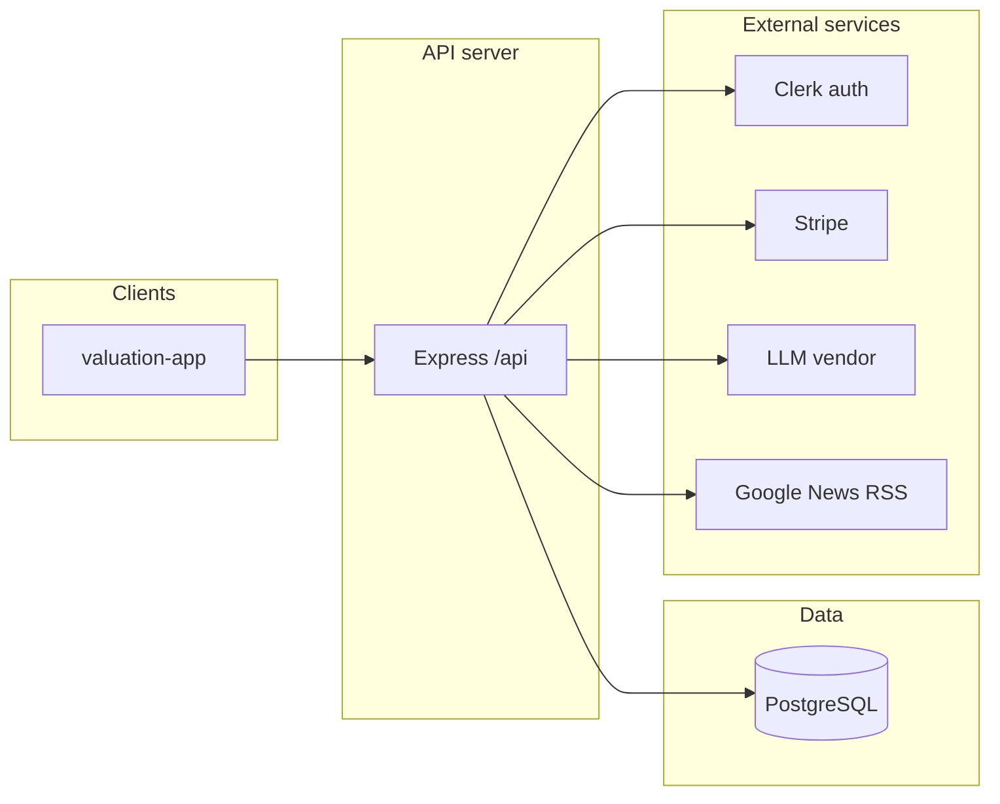
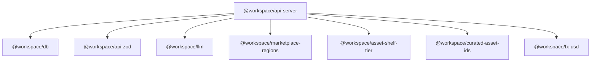
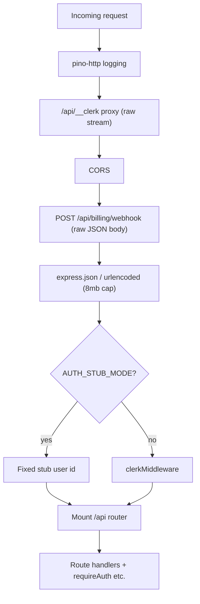
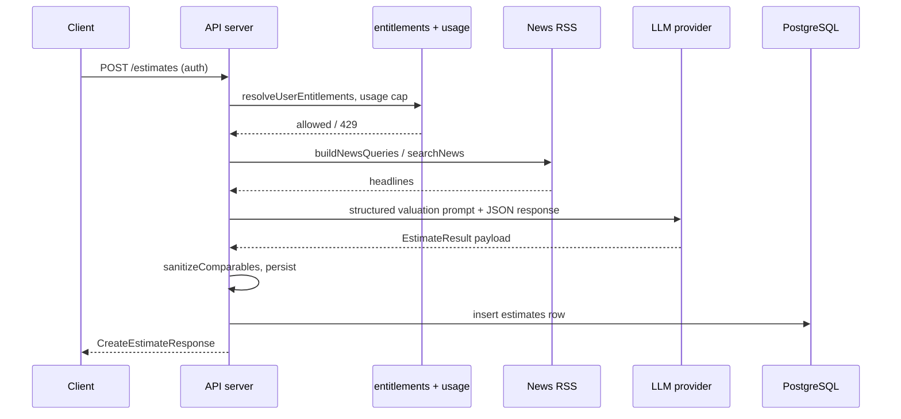
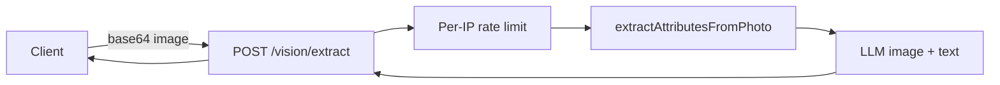
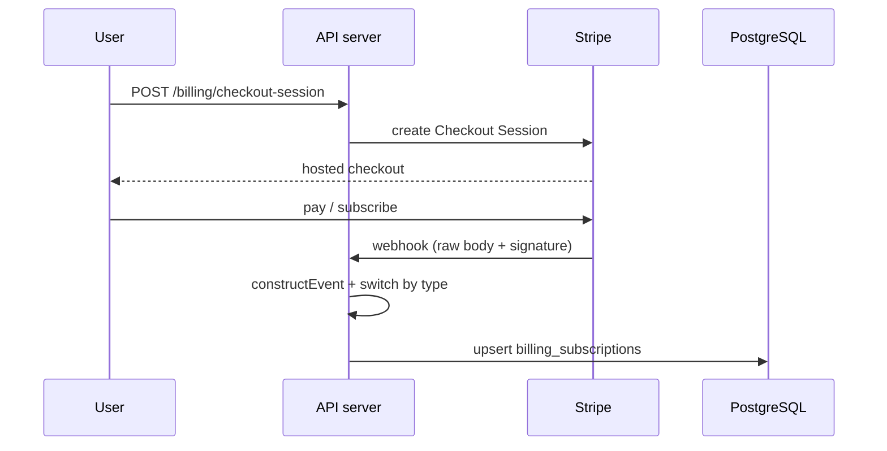

# ValYoued backend architecture

This document describes the backend for the ValYoued product. It is meant to align with the product hub page: [ValYoued (Notion)](https://www.notion.so/rosa-wu/ValYoued-36c429ba9b5a8019a11efb9662c84953). That page had no written spec at the time this file was generated, so the diagrams and notes below are taken from the code in this monorepo (primarily `artifacts/api-server` and `lib/*`).

## Runtime stack

| Layer | Choice |
| --- | --- |
| HTTP server | Express 5 (`artifacts/api-server`) |
| Auth | [Clerk](https://clerk.com/) via `@clerk/express` (optional `AUTH_STUB_MODE` for local dev) |
| Database | PostgreSQL via [Drizzle ORM](https://orm.drizzle.team/) (`lib/db`) |
| Payments | [Stripe](https://stripe.com/) (Checkout, Customer Portal, webhooks) |
| LLM | Pluggable Anthropic or OpenAI (`lib/llm`, env-driven) |
| Shared API contracts | Zod schemas and types (`lib/api-zod`, consumed by server and clients) |

## High-level system context

Clients (web app and any future clients) talk to one API process. The API owns business logic, persists state in Postgres, and calls external services.

## Monorepo packages the server depends on

## HTTP application shape

Mount order matters for a few behaviors: raw body for Stripe, Clerk Frontend API proxy, then JSON parsers, then Clerk session middleware, then `/api` routes.

The main router (`artifacts/api-server/src/routes/index.ts`) applies middleware and composes feature routers (health, geo, FX, portfolios, estimates, vision, listings, admin, `me`, desk, billing). Stripe webhooks live **outside** that router on `POST /api/billing/webhook` so they stay on a raw body for signature verification.

## Major API surface (under `/api`)

These paths are illustrative; see each file under `artifacts/api-server/src/routes/` for the full list.

| Area | Examples | Typical auth |
| --- | --- | --- |
| Health | `GET /healthz` | Public |
| Reference data | `GET /asset-types`, `GET /regions`, `GET /geo`, `GET /fx/rates` | Public |
| Estimates | `GET /estimates`, `POST /estimates`, `GET /estimates/:id`, stats | List/stats allow guest empty data; create requires auth |
| Vision | `POST /vision/extract` | Public with IP rate limit; logs user id when present |
| Listings | `GET /listings`, `POST /listings`, `GET /listings/:id` | Mixed |
| Portfolios | `GET/POST /portfolios` | Auth |
| Desk | `GET /me/desk/*` | Auth |
| Account | `GET /me/billing`, email alerts, data export | Auth |
| Billing | `POST /billing/checkout-session`, portal, inheritance add-on | Auth |
| Admin | `GET /admin/*` | Admin gate |

## Core flow: create an estimate

`POST /estimates` enforces entitlements (free monthly cap vs paid plans), resolves portfolio, builds comparables/news context, calls the LLM via `generateEstimate`, sanitizes structured output, persists a row in `estimates`, records platform events, and may notify by email.

Estimate domain logic lives in `artifacts/api-server/src/lib/estimate.ts` (prompting, parsing, validation) with shared types from `lib/api-zod`.

## Core flow: vision (photo extraction)

Photo upload hits a separate route with stricter IP rate limiting; it uses vision-capable LLM calls in `artifacts/api-server/src/lib/vision.ts` (not shown in detail here).

## Billing and subscription state

User-initiated checkout and portal sessions are created under `/api/billing/*`. Stripe sends events to `POST /api/billing/webhook`. The handler verifies signatures, then upserts `billing_subscriptions` (see `lib/db/src/schema/billing.ts`) so plan tier, status, and add-ons stay in sync with Stripe.

Inheritance add-ons can be represented as a line item on the main subscription or a separate Stripe subscription; the webhook merge logic in `artifacts/api-server/src/billingWebhook.ts` reflects both shapes.

## Data model (Drizzle schema modules)

Schema is split under `lib/db/src/schema/` and re-exported from `lib/db/src/schema/index.ts`, including:

- `valuations`, `estimates`, `listings`
- `portfolios`, `desk-layout`, `estimate-usage`
- `billing` (`billing_subscriptions`)
- `platform-events`, `user-alert-prefs`

The API uses `DATABASE_URL` and a shared `db` handle from `lib/db/src/index.ts` (node-postgres pool + Drizzle).

## Configuration highlights

Set in the API process environment (see `load-env`, route handlers, and `lib/llm`):

- **Clerk**: standard Clerk keys (when not in auth stub mode)
- **`DATABASE_URL`**: required for `lib/db`
- **LLM**: `LLM_PROVIDER`, model override, vendor API keys / base URLs
- **Stripe**: `STRIPE_SECRET_KEY`, webhook secret, price IDs for plans and add-ons
- **App URLs**: used for Stripe redirect URLs (`PUBLIC_APP_URL`, `VITE_APP_ORIGIN` fallbacks)

## Local and safety switches

- **`AUTH_STUB_MODE`**: bypasses Clerk and uses a fixed user id (must not be used in production; see `assertStubNotProduction`).
- **`isStripeStubMode()`**: short-circuits Stripe calls for dev/testing where configured.

## Related documentation

- [Valuations and proprietary model](./VALUATIONS_AND_PROPRIETARY_MODEL.md): end-to-end estimate flow, stored data, and posture for future proprietary model development.

---

*If you add architecture notes to the Notion page above, consider linking back to this file in the repo so product and implementation stay aligned.*
