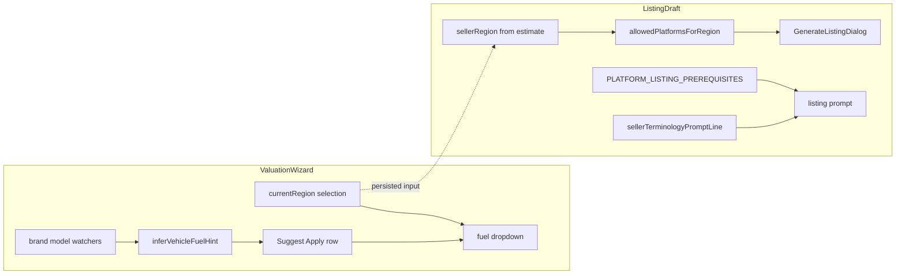

# Marketplace availability, prerequisites, autocomplete, and locale terminology

Companion to [marketplaces-by-region.md](./marketplaces-by-region.md) (manual allowlist assumptions and review cadence).

**Purpose:** Extend and maintain a research-backed layer so sellers only see marketplaces viable for **their valuation region**, listing drafts steer missing **publish-time details**, valuations collect **pricing-relevant** facts early where needed, **inferred defaults** accelerate common fields (cars, etc.), and copy uses **locale-appropriate wording**.

**Audience:** Engineers and whoever owns quarterly marketplace review.

## Implementation backlog (tracked tasks)

When executing this roadmap, prefer issues or Linear over this list; kept here as a checklist.

1. Define JSON/DB schema for marketplace availability + prerequisite rows with source URLs, confidence, effectiveDate, and vertical/tier keys.
2. Add scheduled and on-demand research job (domain allowlist, citations required) that produces diffs against allowlist + prerequisites.
3. Wire allowlist reader to merge baseline `REGION_TO_PLATFORMS` map with researched overlay behind feature flag; keep `POST /listings` in sync.
4. Add structured prerequisite checklist in `GenerateListingDialog` for blocker-level gaps before `POST /listings`.
5. Add inference modules beyond fuel (transmission etc.) mirroring wizard Apply pattern + tests.
6. Broaden REGION_GROUPS/synonyms and `localizeField` mappings; document review cadence in `marketplaces-by-region.md`.

---

## Current implementation (baseline)

Today the product uses **explicit curation**, not automated web scraping.

### Regional marketplace allowlist

- **Source:** [lib/marketplace-regions/src/allowlist.ts](../lib/marketplace-regions/src/allowlist.ts) maps **valuation region display names** (aligned with [artifacts/api-server/src/lib/regions.ts](../artifacts/api-server/src/lib/regions.ts)) to `ListingPlatformSlug[]`.
- **UI:** [artifacts/valuation-app/src/components/GenerateListingDialog.tsx](../artifacts/valuation-app/src/components/GenerateListingDialog.tsx) intersects configured platforms with `allowedPlatformsForRegion(sellerRegion)`.
- **API:** [artifacts/api-server/src/routes/listings.ts](../artifacts/api-server/src/routes/listings.ts) rejects `platform` outside the allowlist for the seller region.
- **Assumptions and review:** [docs/marketplaces-by-region.md](./marketplaces-by-region.md) notes manual matrix, AutoTrader/Gumtree UK URLs, Craigslist rationale, quarterly review cadence.

### Listing prerequisite hints (prompt-driven)

- **Data:** [lib/marketplace-regions/src/listing-prerequisites.ts](../lib/marketplace-regions/src/listing-prerequisites.ts) holds `PLATFORM_LISTING_PREREQUISITES`: short prose per platform describing typical buyer-critical fields (not compliance).
- **Injection:** [artifacts/api-server/src/lib/listing.ts](../artifacts/api-server/src/lib/listing.ts) folds `prerequisitesBlockForPlatform(platform)` plus `sellerTerminologyPromptLine(i.currentRegion)` into the Anthropic listing prompt and instructs the model to emit a **`Still need from seller:`** block when ITEM data lacks required nuance.

### Locale terminology for listing copy

- **Data:** [lib/marketplace-regions/src/seller-terminology.ts](../lib/marketplace-regions/src/seller-terminology.ts) maps region groups (UK, US, EU members, JP, ME, APAC-ish, BR) to a single **prompt line** (petrol/boot/MOT vs trunk/gasoline/ZIP code, ITV, shaken, generic fallback).
- **Same listing prompt** consumes this string in [listing.ts](../artifacts/api-server/src/lib/listing.ts) as `localeTerms`.

### Autocomplete-style inference (example: vehicle fuel)

- **Logic:** [lib/marketplace-regions/src/vehicle-inference.ts](../lib/marketplace-regions/src/vehicle-inference.ts) derives a **hint** plus human-readable explanation from brand + model substring match (electric, diesel, ambiguous).
- **Wizard UX:** [artifacts/valuation-app/src/pages/estimates/new.tsx](../artifacts/valuation-app/src/pages/estimates/new.tsx) shows a dashed suggestion box plus **Apply** that maps inferred label to dropdown options via `matchFuelDropdownOption` in the same package.
- **Tests:** [lib/marketplace-regions/src/allowlist-and-inference.test.ts](../lib/marketplace-regions/src/allowlist-and-inference.test.ts).

---

## Target state: Web calls and agents

**Goal:** Add a **maintained knowledge layer** with **citations** so marketplace availability and listing requirements evolve without only reading code comments. Humans stay in charge of promotion to production configs.

### 1) Research artifacts (structured output)

Maintain versioned artifacts (choose one persistence style when implementing):

- **Option A:** JSON or YAML in-repo under `docs/research/marketplaces/` with `effectiveDate`, `sourceUrls`, `confidence`, reviewer.
- **Option B:** DB table (`marketplace_region_fact`, `platform_listing_requirement`) with nightly job IDs.

Suggested record shapes:

- **availability:** `{ platformSlug, sellerCountryISO, acceptsListingsRelativeToSeller, evidence[], confidence }`
- **requirements:** `{ platformSlug, vertical, severity: blocker | strong | optional, collector: valuation_step | listing_step | both, questionText, tiesToFields[] }`

**Agent prompts** should require **primary URLs** from official help centres, not forum hearsay, unless marked low confidence.

### 2) Two refresh modes

- **Scheduled batch:** For each `{ platformSlug, tier1Country }`, fetch known FAQ URLs; extract availability + vertical rules; emit diffs versus last snapshot.
- **On-demand:** When a seller selects a rarely used region alias, enqueue a constrained search (budget + timeout + allowlist domains).

**Promotion path:** staging artifact to engineer review ([marketplaces-by-region.md](./marketplaces-by-region.md) changelog) to merge regenerated `REGION_TO_PLATFORMS`, or overlay table read at runtime behind a feature flag.

### 3) Tailor ads/UI strictly to researched allowlist

- Keep **single choke point:** `allowedPlatformsForRegion` (or renamed `suggestedPostingPlatforms`) reads **union(handwritten baseline, researched overlay)** gated by confidence.
- **Dialog + POST /listings** continue to intersect; add telemetry when a platform is suppressed so you can tune false negatives.

### 4) Prerequisites: from prose blocks to gated questions

Today prerequisites are narrative strings injected into prompts. Extend toward:

| Severity | Behaviour |
|----------|-----------|
| **Blocker for publish** | Show checklist in **GenerateListingDialog** before POST; optionally block Generate until ACK or minimal fields captured in a small keyed form mirrored into `estimate.input.extraFields` or local dialog state forwarded as attributes. |
| **Strong buyer expectation** | Keep prompt block + deterministic UI chips ("Add MOT expiry") when region + platform + vertical match. |
| **Pricing impact** | Add or reuse **wizard value-driver** fields (`assetTypes.ts` prompt fields) instead of burying inside listing-only copy. |

The LLM can still summarise narrative, but **structured answers** reduce hallucinated compliance.

### 5) Inference and autocomplete roadmap

Reuse the **vehicle fuel** pattern elsewhere:

| Domain | Signals | Dropdown / field |
|--------|---------|-------------------|
| Vehicle | make + model keywords | transmission, fuel, drivetrain (careful multi-variant trims) |
| Watch | calibre + diameter keywords | winding type, complication hints (hypothesis only, never factual) |
| Electronics | SKU patterns | connectivity / storage tiers when unambiguous |

**Rules:** Inference returns `{ suggestedValue, reason, editable }`; UI never submits as fact unless user clicks Apply.

Centralise matchers in **`@workspace/marketplace-regions`** (new `*-inference.ts` modules) with tests parallel to [allowlist-and-inference.test.ts](../lib/marketplace-regions/src/allowlist-and-inference.test.ts).

### 6) Terminology enrichment

Current region groups are coarse. Enhancements:

- Map valuation region → **priority locale bucket** consistently (consider ISO codes on `regions.ts` later).
- Expand synonym tables feeding **seller terminology line** plus **wizard field labels** via existing [artifacts/valuation-app/src/lib/regional.ts](../artifacts/valuation-app/src/lib/regional.ts) (`localizeField`) where field labels differ materially (mileage/km vs miles, tyre vs tire).
- Add **automated glossary sync** caution: glossary popovers (`estimate-glossary.ts`) remain human-reviewed; optionally auto-suggest glossary entries only as PR drafts reviewed by editors.

---

## Acceptance criteria

- **Allowlist fidelity:** Changing research JSON (or staged DB overlay) adjusts visible platforms without app redeploy OR with one config deploy workflow documented.
- **Security:** Scraping/agent jobs sandboxed; no secrets in repos; timeouts and domain allowlists to prevent SSRF creep.
- **Prompt safety:** Prerequisites block cites only facts inferred from ITEM + structured extras; unresolved items appear under **Still need from seller**.
- **UX:** Sellers never see suppressed platforms when region is authoritative; resumed estimates with incompatible region still degrade gracefully after review.
- **Tests:** Fixture regions per geography for allowlist; golden prompt fragments for prerequisites + terminology; inference unit tests per vertical.

---

## Suggested implementation order

1. **Schema + docs folder** for research snapshots and review checklist (extends [marketplaces-by-region.md](./marketplaces-by-region.md)).
2. **Runtime reader** for overlay with feature flag; keep [allowlist.ts](../lib/marketplace-regions/src/allowlist.ts) as safe default.
3. **Agent job** (CI or scheduled worker) producing diff PRs for allowlist and prerequisite tables.
4. **Dialog structured checklist** for blocker-level prerequisites before generate.
5. **Additional inference modules** (transmission, watch hints) following fuel pattern.
6. **Region ISO migration** (optional) to align research keys with standards.

---

## Files to touch when building (reference)

- Allowlist and filters: [lib/marketplace-regions/src/allowlist.ts](../lib/marketplace-regions/src/allowlist.ts), [GenerateListingDialog.tsx](../artifacts/valuation-app/src/components/GenerateListingDialog.tsx), [listings.ts route](../artifacts/api-server/src/routes/listings.ts)
- Prerequisites and terminology: [listing-prerequisites.ts](../lib/marketplace-regions/src/listing-prerequisites.ts), [seller-terminology.ts](../lib/marketplace-regions/src/seller-terminology.ts), [listing.ts](../artifacts/api-server/src/lib/listing.ts)
- Inference: [vehicle-inference.ts](../lib/marketplace-regions/src/vehicle-inference.ts), wizard field wiring in [new.tsx](../artifacts/valuation-app/src/pages/estimates/new.tsx)
- Operational note: [marketplaces-by-region.md](./marketplaces-by-region.md)
